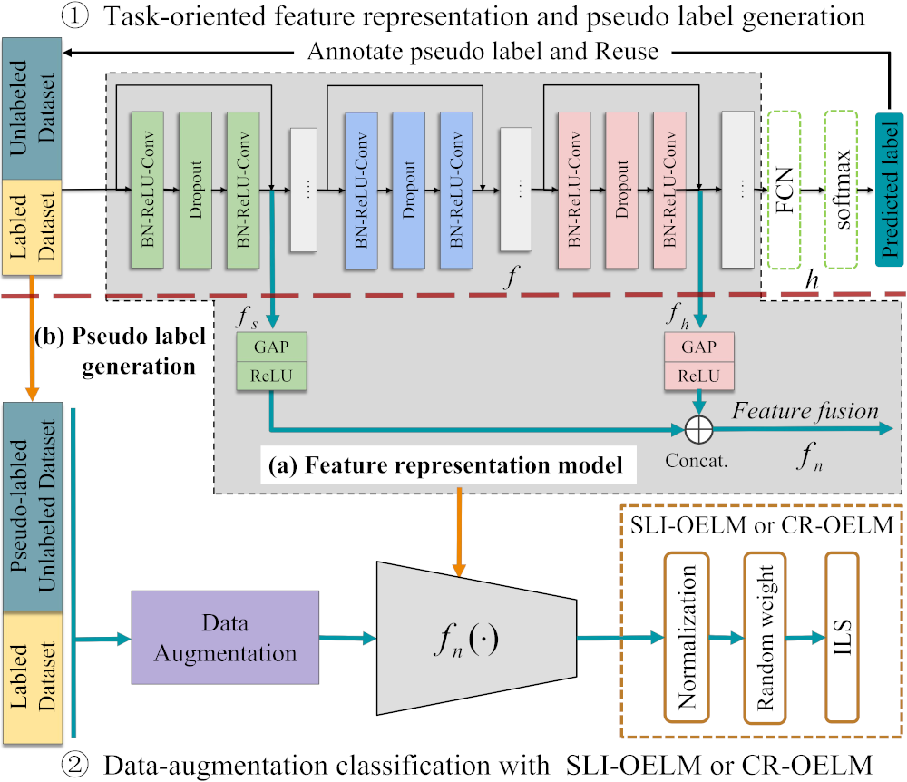
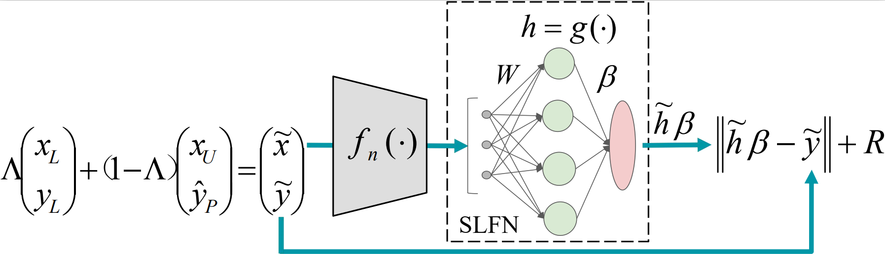
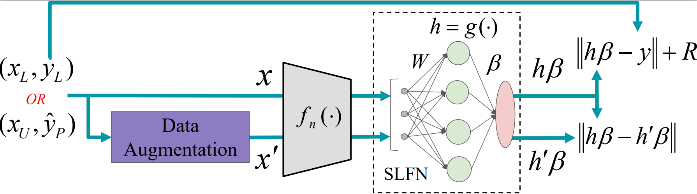

This project summarizes and provides the core code of the paper "Robust semi-supervised classification based on data augmented online ELMs with deep features", which has been accepted by Knowledge-Based Systems. 

<div align=center>

### Introduction

This paper proposed a new semi-supervised classification method that relieving the confirmation bias of self-training-based semi-supervised learning via decoupling feature representation and classifier. Its core component is in the retraining step of the classifier in the decoupling, where the classifer use the pseudo labels and features generated by the decoupled self-training model as its input, such as the above figure, that it, it convert the semi-supervised classifier learning problem into a noise full-supervised learning problem. In order to improve the noise robustness of the classifier, we propose two data augmented ELM classifiers  from the perspective of Vicinal Risk Minimization principle to deal with the noisy features and labels. These two classifiers proposed can be applied not only in semi-supervised learning, but also in supervised and other fields. When applied to semi-supervised learning, it can be combined with most semi-supervised learning methods, such as MixMatch.


This project provides the code demo for these two classifiers (SLI-OELM and CR-OELM) on MNIST dataset.  

#### Usage

- ###### SLI-OELM

<div align=center>

```
python train.py --ELM 'SLI-OELM'  --hidden_size 1200  --c 0.01  --alpha 0.6  --label-noise-level 0.6  --scale-ratio-level 0.16
```


- ###### CR-OELM

<div align=center>

```
python train.py --ELM 'CR-OELM'  --hidden_size 1200  --c 0.01  --c1 0.42  --label-noise-level 0.6  --scale-ratio-level 0.16
```

- ###### L2-OS-ELM

```
python train.py --ELM 'L2-OSELM'  --hidden_size 1200  --c 0.01  --label-noise-level 0.6  --scale-ratio-level 0.16
```


### Requirements

```
- python 3.7+
- torch 1.8.0 
- torchvision 0.9.0
- numpy
- cupy 9.2.0 
- Pillow 8.3.0
```


### Citations

```
@article{sohn2020fixmatch,
    title={Robust semi-supervised classification based on data augmented online ELMs with deep features},
    author={Xiaochang Hu, Yujun Zeng, Xin Xu and Sihang Zhou and Li Liu},
    journal={Knowledge-Based Systems}
    year={2021},
}
```

